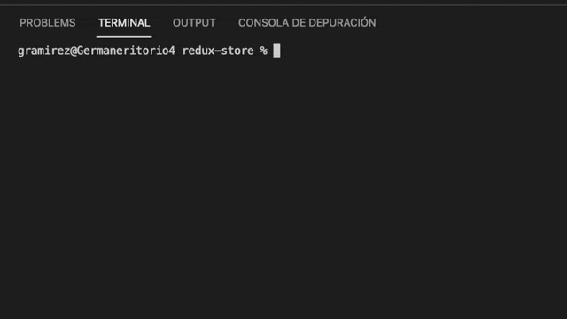

# Redux Store


_This repository contains  the MERN e-commerce Service that will let you show and sell  your products. This system have a secure payment system that is Stripe so you dont have to worry on store sensiteve data from your clients._ 

## Table of Contents

- [`Installation`](#installation)
- [`Usage`](#usage)
- [`Test`](#test)
- [`License`](#license)
- [`Questions`](#questions)

## Installation

`Use the package manager [npm](https://docs.npmjs.com/cli/v7/commands/npm-install) to install all the dependencies that are on the files package.json inside the app`

```bash
npm install
```

## Usage

`To Run the system locally you need to use the follow command on the main directory and execute the follow commands:`

```bash
npm run seed
```
`This will insert data into you Collection and can see products and some users informartion to login. After that you need to run the follow to init the system:`
```bash
npm run develop
```


## Test

`This system count with one test case in order to check that the reducers are working properly.So you can execute that by doing the follow commands:`

```bash
cd client
```
`And then :`

```bash
npm run test
```


## [Redux Store GitHub Code](https://github.com/izaack89/book-search-engine)

## [Redux Store Live](https://young-garden-30489.herokuapp.com/ )

## Redux Store References
- [Deploy Heroku and Mongo](https://coding-boot-camp.github.io/full-stack/mongodb/deploy-with-heroku-and-mongodb-atlas)- Heroku and Mongo Deploy
- [StackOverFlow](https://stackoverflow.com/questions/18660474/push-rejected-failed-to-compile-node-js-app-heroku) - Heroku Issues NodeJS
- [Heroku Issues](https://help.heroku.com/6235QYN4/why-is-my-node-js-build-failing-because-of-no-matching-node-versions) - Heroku Topic
- [GraphQL](https://graphql.org/graphql-js/) - GraphQl Information
- [GraphQl Input](https://graphql.org/graphql-js/mutations-and-input-types/) - GraphQl Input
- [Redux Part 1](https://redux.js.org/tutorials/fundamentals/part-1-overview) - Redux Tutorial Part 1
- [Redux part 2](https://redux.js.org/tutorials/fundamentals/part-2-concepts-data-flow) - Redux Tutorial Part 2
- [Dispatch Error](https://stackoverflow.com/questions/35443167/dispatch-is-not-a-function-when-argument-to-maptodispatchtoprops-in-redux) - Dispatch error 
- [Stripe](https://stripe.com/docs/stripe-vscode) - Stripe Documentation


## Questions

If you have any questions about the repository, open an issue or contact me directly at mitsuominagi@gmail.com. You can find more of my work at [izaack89](https://github.com/izaack89)
\
&nbsp;\
&nbsp;
## Author

- **German Ramirez** - [GitHub](https://github.com/izaack89/)


